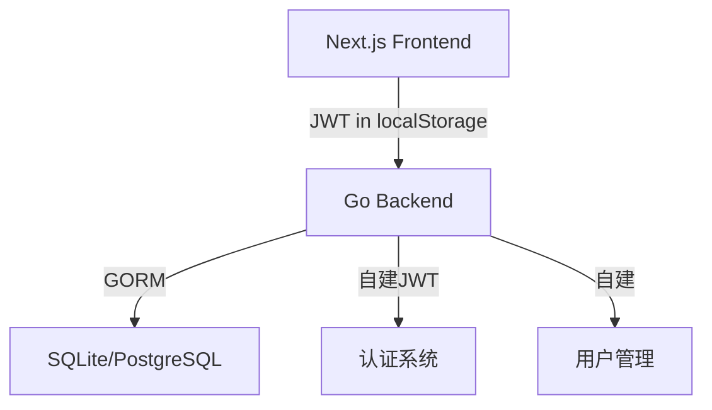
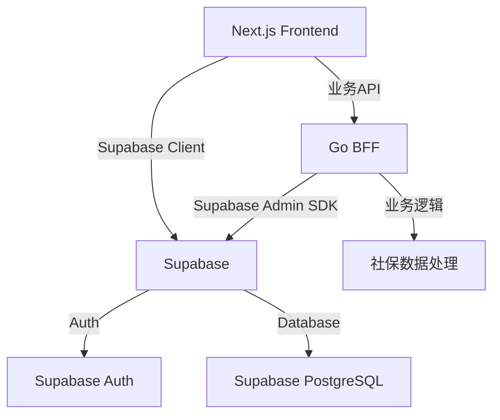

# Supabase 完全迁移计划

> **迁移策略**：方案A - 完全迁移到Supabase，最大化利用Supabase功能
> 
> **目标架构**：Supabase Auth + Supabase PostgreSQL + Go业务逻辑层（BFF模式）

---

## 📋 目录

1. [迁移概述](#迁移概述)
2. [目标架构](#目标架构)
3. [迁移阶段](#迁移阶段)
4. [数据库模式迁移](#数据库模式迁移)
5. [认证系统迁移](#认证系统迁移)
6. [前端改造](#前端改造)
7. [后端改造](#后端改造)
8. [迁移步骤](#迁移步骤)
9. [风险评估](#风险评估)
10. [回滚策略](#回滚策略)

---

## 迁移概述

### 当前架构



### 目标架构



### 核心变更

| 组件 | 当前 | 目标 | 变更程度 |
|------|------|------|----------|
| **认证** | Go JWT | Supabase Auth | 🔴 完全重构 |
| **用户管理** | Go + GORM | Supabase Auth.users | 🔴 完全迁移 |
| **数据库** | SQLite/PostgreSQL | Supabase PostgreSQL | 🟡 迁移+适配 |
| **前端API** | fetch + localStorage | Supabase Client | 🟡 部分重构 |
| **后端API** | Chi路由器 | Chi + Supabase SDK | 🟢 适配修改 |
| **业务逻辑** | Go服务 | Go BFF | 🟢 保持不变 |

---

## 目标架构

### 架构分层

#### 1. 前端层（Next.js）
```typescript
// 使用 @supabase/supabase-js
import { createClient } from '@supabase/supabase-js'

const supabase = createClient(
  process.env.NEXT_PUBLIC_SUPABASE_URL!,
  process.env.NEXT_PUBLIC_SUPABASE_ANON_KEY!
)
```

**职责**：
- ✅ 使用Supabase Client进行认证（登录、注册、登出）
- ✅ 直接查询简单的业务数据（通过Supabase RLS）
- ✅ 调用Go BFF处理复杂业务逻辑
- ✅ 实时订阅（可选，用于通知等功能）

#### 2. Go BFF层（业务逻辑）
```go
// 使用 supabase-go SDK
import "github.com/supabase-community/supabase-go"

supabase := supabase.CreateClient(
    os.Getenv("SUPABASE_URL"),
    os.Getenv("SUPABASE_SERVICE_KEY"),
)
```

**职责**：
- ✅ 验证Supabase JWT（中间件）
- ✅ 复杂业务逻辑（社保数据处理、聚合计算）
- ✅ Excel文件解析和导入
- ✅ 数据导出（生成Excel）
- ✅ 审计日志记录
- ⚠️ **不再负责**：用户注册、登录、密码管理

#### 3. Supabase层（数据和认证）

**Supabase Auth**：
- 用户注册、登录、登出
- 邮箱验证
- 密码重置
- 会话管理
- MFA（可选）

**Supabase Database**：
- PostgreSQL数据库
- 行级安全策略（RLS）
- 实时订阅
- 自动生成的REST API

---

## 迁移阶段

### 阶段1：环境准备（1天）
- [ ] 创建Supabase项目
- [ ] 配置环境变量
- [ ] 安装依赖包
- [ ] 设置开发/测试/生产环境

### 阶段2：数据库迁移（2-3天）
- [ ] 设计Supabase数据库模式
- [ ] 创建迁移SQL脚本
- [ ] 迁移现有数据
- [ ] 配置RLS策略
- [ ] 测试数据完整性

### 阶段3：认证系统迁移（2-3天）
- [ ] 配置Supabase Auth
- [ ] 前端集成Supabase Auth
- [ ] 迁移用户数据
- [ ] 实现Go BFF的JWT验证
- [ ] 测试认证流程

### 阶段4：前端改造（3-4天）
- [ ] 创建Supabase client工具函数
- [ ] 重构认证相关组件
- [ ] 适配API调用（区分直接调用vs BFF）
- [ ] 更新状态管理
- [ ] UI/UX测试

### 阶段5：后端改造（3-4天）
- [ ] 集成Supabase Go SDK
- [ ] 实现JWT验证中间件
- [ ] 重构数据访问层
- [ ] 移除自建认证代码
- [ ] API测试

### 阶段6：测试和优化（2-3天）
- [ ] 功能测试
- [ ] 性能测试
- [ ] 安全测试
- [ ] 修复bug
- [ ] 文档更新

### 阶段7：部署上线（1-2天）
- [ ] 数据备份
- [ ] 生产环境配置
- [ ] 灰度发布
- [ ] 监控和告警
- [ ] 用户通知

**总预计时间**：14-20天

---

## 数据库模式迁移

### 用户表变更

#### 当前模型（Go/GORM）
```go
type User struct {
    ID              uint       `json:"id" gorm:"primaryKey"`
    Username        string     `json:"username" gorm:"uniqueIndex;not null"`
    Email           string     `json:"email" gorm:"uniqueIndex;not null"`
    Password        string     `json:"-" gorm:"not null"`
    FullName        string     `json:"full_name"`
    CompanyID       string     `json:"company_id" gorm:"index"`
    Active          bool       `json:"active" gorm:"default:true"`
    EmailVerified   bool       `json:"email_verified" gorm:"default:false"`
    EmailVerifiedAt *time.Time `json:"email_verified_at,omitempty"`
    CreatedAt       time.Time  `json:"created_at"`
    UpdatedAt       time.Time  `json:"updated_at"`
}
```

#### 目标模型（Supabase）

**auth.users表**（Supabase内置，不可修改）
```sql
-- Supabase自动管理
CREATE TABLE auth.users (
  id uuid PRIMARY KEY,
  email text UNIQUE,
  encrypted_password text,
  email_confirmed_at timestamptz,
  created_at timestamptz,
  updated_at timestamptz,
  ...
);
```

**public.profiles表**（扩展用户信息）
```sql
CREATE TABLE public.profiles (
  id uuid PRIMARY KEY REFERENCES auth.users(id) ON DELETE CASCADE,
  username text UNIQUE NOT NULL,
  full_name text,
  company_id text,
  active boolean DEFAULT true,
  created_at timestamptz DEFAULT now(),
  updated_at timestamptz DEFAULT now()
);

-- 启用RLS
ALTER TABLE public.profiles ENABLE ROW LEVEL SECURITY;

-- 用户只能查看和更新自己的profile
CREATE POLICY "Users can view own profile"
  ON public.profiles FOR SELECT
  USING (auth.uid() = id);

CREATE POLICY "Users can update own profile"
  ON public.profiles FOR UPDATE
  USING (auth.uid() = id);
```

### 业务表迁移

#### Period表
```sql
CREATE TABLE public.periods (
  id bigserial PRIMARY KEY,
  user_id uuid REFERENCES auth.users(id) ON DELETE SET NULL,
  year_month text NOT NULL,
  status text NOT NULL,
  created_at timestamptz DEFAULT now(),
  updated_at timestamptz DEFAULT now()
);

CREATE INDEX idx_periods_user_id ON public.periods(user_id);
CREATE INDEX idx_periods_year_month ON public.periods(year_month);

-- RLS策略
ALTER TABLE public.periods ENABLE ROW LEVEL SECURITY;

CREATE POLICY "Users can manage own periods"
  ON public.periods
  USING (auth.uid() = user_id);
```

#### SourceFile表
```sql
CREATE TABLE public.source_files (
  id bigserial PRIMARY KEY,
  user_id uuid REFERENCES auth.users(id) ON DELETE SET NULL,
  period_id bigint REFERENCES public.periods(id) ON DELETE CASCADE,
  file_name text NOT NULL,
  stored_path text NOT NULL,
  scheme text NOT NULL,
  part text NOT NULL,
  file_type text DEFAULT 'normal',
  rows int NOT NULL,
  status text NOT NULL,
  uploaded_at timestamptz NOT NULL,
  original_name text,
  notes text,
  created_at timestamptz DEFAULT now(),
  updated_at timestamptz DEFAULT now()
);

CREATE INDEX idx_source_files_user_id ON public.source_files(user_id);
CREATE INDEX idx_source_files_period_id ON public.source_files(period_id);
CREATE INDEX idx_source_files_scheme ON public.source_files(scheme);
CREATE INDEX idx_source_files_part ON public.source_files(part);
CREATE INDEX idx_source_files_file_type ON public.source_files(file_type);

-- RLS策略
ALTER TABLE public.source_files ENABLE ROW LEVEL SECURITY;

CREATE POLICY "Users can manage own source files"
  ON public.source_files
  USING (auth.uid() = user_id);
```

#### 其他业务表
```sql
-- RawRecord, PeriodSummary, PersonalCharge, UnitCharge, RosterEntry, AuditLog
-- 类似的迁移模式：
-- 1. user_id从uint改为uuid
-- 2. 添加外键约束到auth.users或profiles
-- 3. 配置RLS策略
-- 4. 创建必要的索引
```

### 迁移SQL脚本

创建文件：`supabase/migrations/001_initial_schema.sql`

```sql
-- 1. 创建profiles表
CREATE TABLE public.profiles (
  id uuid PRIMARY KEY REFERENCES auth.users(id) ON DELETE CASCADE,
  username text UNIQUE NOT NULL,
  full_name text,
  company_id text,
  active boolean DEFAULT true,
  created_at timestamptz DEFAULT now(),
  updated_at timestamptz DEFAULT now()
);

ALTER TABLE public.profiles ENABLE ROW LEVEL SECURITY;

CREATE POLICY "Users can view own profile"
  ON public.profiles FOR SELECT
  USING (auth.uid() = id);

CREATE POLICY "Users can update own profile"
  ON public.profiles FOR UPDATE
  USING (auth.uid() = id);

-- 2. 创建业务表（periods, source_files等）
-- ... (见上文各表定义)

-- 3. 创建触发器（自动更新updated_at）
CREATE OR REPLACE FUNCTION public.handle_updated_at()
RETURNS TRIGGER AS $$
BEGIN
  NEW.updated_at = now();
  RETURN NEW;
END;
$$ LANGUAGE plpgsql;

CREATE TRIGGER set_updated_at
  BEFORE UPDATE ON public.profiles
  FOR EACH ROW
  EXECUTE FUNCTION public.handle_updated_at();

-- 为其他表添加类似触发器...

-- 4. 创建函数（用于复杂业务逻辑）
CREATE OR REPLACE FUNCTION public.get_user_periods(user_uuid uuid)
RETURNS TABLE (
  id bigint,
  year_month text,
  status text,
  created_at timestamptz
) AS $$
BEGIN
  RETURN QUERY
  SELECT p.id, p.year_month, p.status, p.created_at
  FROM public.periods p
  WHERE p.user_id = user_uuid
  ORDER BY p.year_month DESC;
END;
$$ LANGUAGE plpgsql SECURITY DEFINER;
```

### 数据迁移脚本

创建文件：`scripts/migrate_data_to_supabase.go`

```go
package main

import (
    "database/sql"
    "log"
    "github.com/supabase-community/supabase-go"
)

func migrateUsers(oldDB *sql.DB, supabase *supabase.Client) error {
    // 1. 从旧数据库读取用户
    rows, err := oldDB.Query("SELECT id, username, email, full_name, company_id FROM users")
    if err != nil {
        return err
    }
    defer rows.Close()

    // 2. 在Supabase中创建用户
    for rows.Next() {
        var oldID uint
        var username, email, fullName, companyID string
        
        if err := rows.Scan(&oldID, &username, &email, &fullName, &companyID); err != nil {
            log.Printf("Error scanning user: %v", err)
            continue
        }

        // 使用Supabase Admin API创建用户
        // 注意：需要使用service_role key
        user, err := supabase.Auth.Admin.CreateUser(supabase.UserAttributes{
            Email: email,
            Password: "临时密码-需要用户重置",
            EmailConfirm: true,
        })
        if err != nil {
            log.Printf("Error creating user %s: %v", email, err)
            continue
        }

        // 3. 创建profile
        profile := map[string]interface{}{
            "id": user.ID,
            "username": username,
            "full_name": fullName,
            "company_id": companyID,
        }
        
        if err := supabase.DB.From("profiles").Insert(profile).Execute(); err != nil {
            log.Printf("Error creating profile for %s: %v", email, err)
        }

        // 4. 记录ID映射（用于后续迁移关联数据）
        // oldID -> user.ID
    }

    return nil
}

// 类似的函数用于迁移其他表...
```

---

## 认证系统迁移

### Supabase Auth配置

在Supabase Dashboard中配置：

1. **Authentication Settings**
   - Email provider: 启用
   - Confirm email: 启用
   - Secure email change: 启用
   
2. **Email Templates**（自定义邮件模板）
   ```html
   <!-- 邮箱验证模板 -->
   