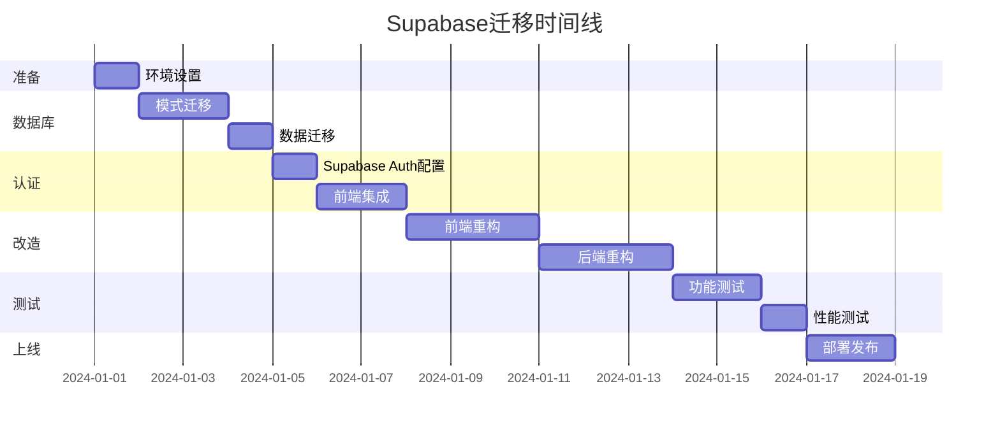

# Supabase 迁移项目总览

> **项目名称**：HR Office 社保管理系统 Supabase 迁移
> 
> **迁移类型**：完全迁移（方案A）
> 
> **预计工期**：14-20天

---

## 📚 文档导航

本次迁移共包含3个核心文档：

| 文档 | 用途 | 阅读顺序 |
|------|------|----------|
| **[SUPABASE_MIGRATION_PLAN.md](./SUPABASE_MIGRATION_PLAN.md)** | 迁移总体计划和架构设计 | ⭐ 首先阅读 |
| **[SUPABASE_MIGRATION_IMPLEMENTATION.md](./SUPABASE_MIGRATION_IMPLEMENTATION.md)** | 详细实施步骤和代码示例 | ⭐⭐ 实施时参考 |
| **[SUPABASE_MIGRATION_CHECKLIST.md](./SUPABASE_MIGRATION_CHECKLIST.md)** | 检查清单和测试计划 | ⭐⭐⭐ 执行时使用 |

---

## 🎯 迁移目标

### 从
```
当前架构：Go后端（自建JWT + GORM + SQLite/PostgreSQL）+ Next.js前端
```

### 到
```
目标架构：Supabase（Auth + PostgreSQL）+ Go BFF（业务逻辑）+ Next.js前端
```

### 核心变更

| 组件 | 变更内容 |
|------|----------|
| **认证** | Go JWT → Supabase Auth |
| **数据库** | SQLite/自托管PostgreSQL → Supabase PostgreSQL |
| **用户管理** | 自建 → Supabase内置 |
| **前端** | fetch + localStorage → Supabase Client |
| **后端** | 完整服务 → BFF模式（仅业务逻辑） |

---

## ⚡ 快速开始

### 第一步：阅读计划文档

```bash
# 理解迁移架构和策略
cat SUPABASE_MIGRATION_PLAN.md
```

**关键内容**：
- 目标架构图
- 数据库模式设计
- 7个迁移阶段
- 风险评估

### 第二步：设置Supabase项目

1. 访问 [https://supabase.com](https://supabase.com)
2. 创建新项目（记录数据库密码）
3. 获取以下配置：
   - Project URL
   - Anon Key
   - Service Role Key
   - JWT Secret

### 第三步：配置本地环境

```bash
# 前端环境变量
cat > frontend/.env.local << EOF
NEXT_PUBLIC_SUPABASE_URL=https://your-project.supabase.co
NEXT_PUBLIC_SUPABASE_ANON_KEY=your-anon-key
NEXT_PUBLIC_BFF_URL=http://localhost:8080/api
EOF

# 后端环境变量
cat > backend/.env << EOF
SUPABASE_URL=https://your-project.supabase.co
SUPABASE_SERVICE_KEY=your-service-role-key
SUPABASE_JWT_SECRET=your-jwt-secret
PORT=8080
EOF
```

### 第四步：执行迁移

按照 `SUPABASE_MIGRATION_CHECKLIST.md` 逐项完成：

```bash
# 阶段1：准备工作（1天）
✅ 创建Supabase项目
✅ 配置环境变量
✅ 安装依赖

# 阶段2：数据库迁移（2-3天）
✅ 创建数据库模式
✅ 配置RLS策略
✅ 迁移数据

# 阶段3-7：继续执行...
```

---

## 📊 迁移时间线



**总计**：14-20个工作日

---

## 🔑 关键文件和位置

### 新增文件

```
项目根目录/
├── SUPABASE_MIGRATION_PLAN.md          # 迁移总计划
├── SUPABASE_MIGRATION_IMPLEMENTATION.md # 实施指南
├── SUPABASE_MIGRATION_CHECKLIST.md     # 检查清单
├── supabase/
│   └── migrations/
│       └── 001_initial_schema.sql      # 数据库迁移脚本
├── scripts/
│   └── migrate_data_to_supabase.go     # 数据迁移工具
├── frontend/
│   ├── .env.local                       # 前端环境变量
│   └── lib/
│       ├── supabase/
│       │   ├── client.ts               # 浏览器端客户端
│       │   └── server.ts               # 服务端客户端
│       ├── auth-context.tsx            # 认证Context
│       └── api.ts                       # 重构后的API层
└── backend/
    ├── .env                             # 后端环境变量
    └── internal/
        ├── supabase/
        │   └── client.go               # Supabase Go客户端
        └── middleware/
            └── supabase_auth.go        # JWT验证中间件
```

### 需要修改的文件

```
frontend/
├── app/
│   ├── layout.tsx                      # 添加AuthProvider
│   └── auth/
│       └── page.tsx                    # 重构登录/注册页面
└── components/
    └── *.tsx                            # 更新所有使用认证的组件

backend/
├── main.go                             # 移除自建认证，集成Supabase
├── internal/
│   ├── api/
│   │   └── auth.go                     # 删除或大幅简化
│   └── models/
│       └── models.go                   # 移除User模型
```

### 需要删除的文件

```
backend/internal/
├── auth/jwt.go                         # 删除自建JWT
├── service/
│   ├── email_service.go                # 删除邮件服务（Supabase处理）
│   ├── email_verification_service.go   # 删除邮箱验证
│   └── password_reset_service.go       # 删除密码重置
```

---

## 🛠️ 技术栈变更

### 前端

| 功能 | 迁移前 | 迁移后 |
|------|--------|--------|
| **HTTP客户端** | `fetch` + 手动token | `@supabase/supabase-js` |
| **状态管理** | localStorage | Supabase session |
| **认证** | 手动实现 | `useAuth` hook |

### 后端

| 功能 | 迁移前 | 迁移后 |
|------|--------|--------|
| **数据库** | GORM + SQLite/PostgreSQL | Supabase Go SDK |
| **认证** | 自建JWT | Supabase JWT验证 |
| **用户管理** | 完整实现 | 委托给Supabase |
| **角色** | 完整服务 | BFF（业务逻辑层） |

---

## ⚠️ 重要注意事项

### 迁移前必读

1. **数据备份**
   ```bash
   # 备份当前数据库
   pg_dump -U user -d siapp -F c -b -v -f backup_$(date +%Y%m%d).dump
   ```

2. **用户通知**
   - 所有用户需要重置密码
   - 提前通知系统升级时间
   - 准备用户指南

3. **测试环境**
   - 先在开发环境完整测试
   - 再在测试环境验证
   - 最后才部署到生产

### 关键决策点

- [x] ✅ 选择方案A（完全迁移）
- [ ] 何时开始迁移？
- [ ] 是否需要灰度发布？
- [ ] 如何处理现有用户密码？

### 回滚策略

如果迁移失败，可以：
1. 恢复数据库备份
2. 切换回旧的Git分支
3. 使用旧的环境变量
4. 重新部署旧版本

---

## 📞 支持和资源

### Supabase官方资源

- [Supabase文档](https://supabase.com/docs)
- [Supabase Auth指南](https://supabase.com/docs/guides/auth)
- [Row Level Security](https://supabase.com/docs/guides/auth/row-level-security)
- [Next.js集成](https://supabase.com/docs/guides/getting-started/quickstarts/nextjs)

### 项目相关文档

- [CLAUDE.md](./CLAUDE.md) - 原始项目文档
- [AGENTS.md](./AGENTS.md) - AI助手规则
- [DATABASE_MIGRATION.md](./DATABASE_MIGRATION.md) - 数据库迁移历史

### 社区支持

- Supabase Discord: [discord.supabase.com](https://discord.supabase.com)
- GitHub Issues: 项目问题追踪
- Stack Overflow: `supabase` 标签

---

## ✨ 迁移后的优势

### 开发效率

- ✅ 无需维护认证系统
- ✅ 自动的数据库备份
- ✅ 内置的实时订阅功能
- ✅ 自动生成的REST API

### 安全性

- ✅ 企业级认证安全
- ✅ 行级安全策略（RLS）
- ✅ 自动的SQL注入防护
- ✅ 定期的安全更新

### 可扩展性

- ✅ 自动扩展的数据库
- ✅ 全球CDN加速
- ✅ 99.9%的SLA保证
- ✅ 实时数据同步

### 成本

- ✅ 免费层支持50MB数据库
- ✅ 无需维护服务器
- ✅ 按需付费模式
- ✅ 降低运维成本

---

## 🚀 开始迁移

准备好了吗？按以下顺序开始：

1. **第一天**：阅读完整迁移计划 → [SUPABASE_MIGRATION_PLAN.md](./SUPABASE_MIGRATION_PLAN.md)
2. **第二天**：设置Supabase项目和环境
3. **第三天**：开始数据库迁移
4. **持续跟进**：使用检查清单追踪进度 → [SUPABASE_MIGRATION_CHECKLIST.md](./SUPABASE_MIGRATION_CHECKLIST.md)

---

## 📝 版本历史

| 版本 | 日期 | 说明 |
|------|------|------|
| 1.0.0 | 2024-01-XX | 初始迁移计划创建 |
| 1.1.0 | 待定 | 迁移完成 |

---

**准备好开始了吗？祝迁移顺利！** 🎉